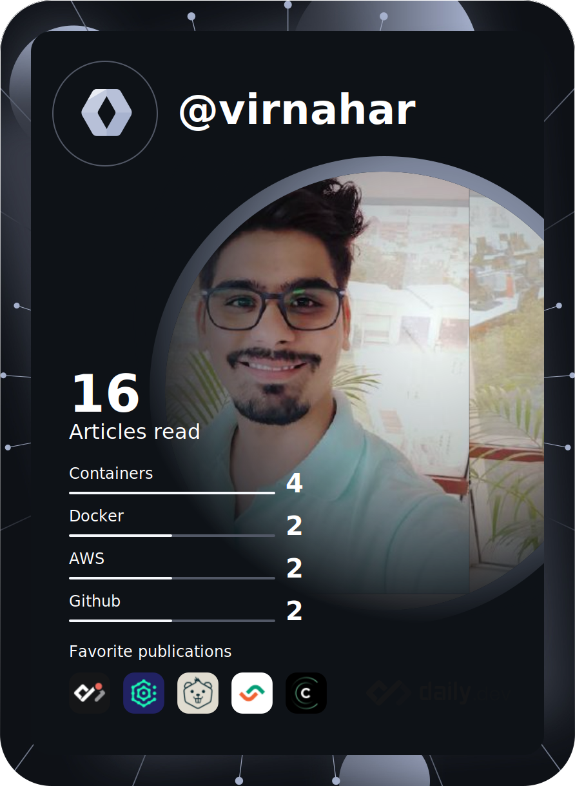

# Hi, I'm  
👉🏻💻💖📷☕

<!-- markdownlint-disable MD033 -->

<!-- markdownlint-enable MD033 -->
📢 Nominate ([@virnahar](https://virnahar.github.io)) as **[GitHub Star](https://stars.github.com/nominate)**. If you appreciate his hardwork and dedication to Automation.

  

DevOps Architect, Cloud Enthusiast, Pictographer, and Technopreneur from the INDIA. 

- ☕ In the world of Coffee lovers I am TEA lover != turning it into code 😋
- 🎯 Wasting my time to save other people's time.
- 📷 Photography is the story I fail to put into words.
- 💡 [Learn more about me](https://virnahar.github.io).

## 🔧 Technologies

    
&#9889 <b>GitHub Stats</b>
 

<!-- markdownlint-enable MD033 -->

---

👉🏻💻💖📷☕ by [Virendra Kumar](https://virnahar.github.io) 🙏

[personal website]: https://virnahar.github.io
[facebook]: https://facebook.com/virnahar
[twitter]: https://twitter.com/virnahar
[instagram]: https://instagram.com/virnahar
[youtube]: https://youtube.com/virnahar
